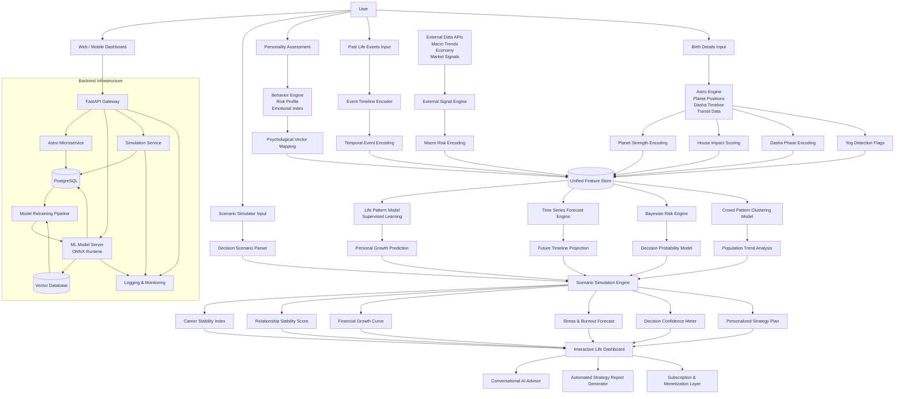

```mermaid
flowchart TD

%% ===================== USER LAYER =====================

U[User] --> UI[Web / Mobile Dashboard]
U --> SCN[Scenario Simulator Input]
U --> PERS[Personality Assessment]
U --> HIST[Past Life Events Input]
U --> BIRTH[Birth Details Input]

%% ===================== DATA INGESTION =====================

BIRTH --> ASTRO[Astro Engine<br/>Planet Positions<br/>Dasha Timeline<br/>Transit Data]
PERS --> BEHAV[Behavior Engine<br/>Risk Profile<br/>Emotional Index]
HIST --> EVENTENC[Event Timeline Encoder]
SCN --> SCENINPUT[Decision Scenario Parser]

EXT[External Data APIs<br/>Macro Trends<br/>Economy<br/>Market Signals] --> EXTENG[External Signal Engine]

%% ===================== FEATURE ENGINEERING =====================

ASTRO --> FE1[Planet Strength Encoding]
ASTRO --> FE2[House Impact Scoring]
ASTRO --> FE3[Dasha Phase Encoding]
ASTRO --> FE4[Yog Detection Flags]

BEHAV --> FE5[Psychological Vector Mapping]
EVENTENC --> FE6[Temporal Event Encoding]
EXTENG --> FE7[Macro Risk Encoding]

FE1 --> FEATURESTORE[(Unified Feature Store)]
FE2 --> FEATURESTORE
FE3 --> FEATURESTORE
FE4 --> FEATURESTORE
FE5 --> FEATURESTORE
FE6 --> FEATURESTORE
FE7 --> FEATURESTORE

%% ===================== CORE INTELLIGENCE LAYER =====================

FEATURESTORE --> ML1[Life Pattern Model<br/>Supervised Learning]
FEATURESTORE --> TS1[Time Series Forecast Engine]
FEATURESTORE --> BAYES[Bayesian Risk Engine]
FEATURESTORE --> CLUSTER[Crowd Pattern Clustering Model]

CLUSTER --> SIM1[Population Trend Analysis]
ML1 --> SIM2[Personal Growth Prediction]
TS1 --> SIM3[Future Timeline Projection]
BAYES --> SIM4[Decision Probability Model]

SCENINPUT --> SIMENGINE[Scenario Simulation Engine]

SIM2 --> SIMENGINE
SIM3 --> SIMENGINE
SIM4 --> SIMENGINE
SIM1 --> SIMENGINE

%% ===================== OUTPUT INTELLIGENCE =====================

SIMENGINE --> OUT1[Career Stability Index]
SIMENGINE --> OUT2[Relationship Stability Score]
SIMENGINE --> OUT3[Financial Growth Curve]
SIMENGINE --> OUT4[Stress & Burnout Forecast]
SIMENGINE --> OUT5[Decision Confidence Meter]
SIMENGINE --> OUT6[Personalized Strategy Plan]

%% ===================== DELIVERY LAYER =====================

OUT1 --> DASH[Interactive Life Dashboard]
OUT2 --> DASH
OUT3 --> DASH
OUT4 --> DASH
OUT5 --> DASH
OUT6 --> DASH

DASH --> CHAT[Conversational AI Advisor]
DASH --> PDF[Automated Strategy Report Generator]
DASH --> SUBS[Subscription & Monetization Layer]

%% ===================== INFRASTRUCTURE =====================

subgraph Backend Infrastructure
API[FastAPI Gateway]
ASTROSVC[Astro Microservice]
MLSVC[ML Model Server<br/>ONNX Runtime]
SIMSVC[Simulation Service]
DB[(PostgreSQL)]
VDB[(Vector Database)]
LOG[Logging & Monitoring]
TRAIN[Model Retraining Pipeline]
end

UI --> API
API --> ASTROSVC
API --> MLSVC
API --> SIMSVC

ASTROSVC --> DB
MLSVC --> DB
SIMSVC --> DB

MLSVC --> VDB
VDB --> TRAIN
DB --> TRAIN

API --> LOG
MLSVC --> LOG
SIMSVC --> LOG

TRAIN --> MLSVC

```
